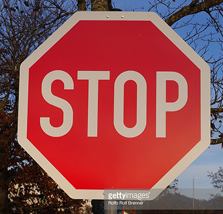

# **Traffic Sign Recognition** 

## Writeup

---

**Build a Traffic Sign Recognition Project**

The goals / steps of this project are the following:
* Load the data set (see below for links to the project data set)
* Explore, summarize and visualize the data set
* Design, train and test a model architecture
* Use the model to make predictions on new images
* Analyze the softmax probabilities of the new images
* Summarize the results with a written report

[//]: # (Image References)

[image1]: ./writeup_images/data_visualization.png "Visualization"
[image2]: ./examples/grayscale.jpg "Grayscaling"
[image3]: ./examples/random_noise.jpg "Random Noise"
[image4]: ./examples/placeholder.png "Traffic Sign 1"
[image5]: ./examples/placeholder.png "Traffic Sign 2"
[image6]: ./examples/placeholder.png "Traffic Sign 3"
[image7]: ./examples/placeholder.png "Traffic Sign 4"
[image8]: ./examples/placeholder.png "Traffic Sign 5"

## Rubric Points
### Here I will consider the [rubric points](https://review.udacity.com/#!/rubrics/481/view) individually and describe how I addressed each point in my implementation.  

---
### Writeup / README

#### 1. Provide a Writeup / README that includes all the rubric points and how you addressed each one. You can submit your writeup as markdown or pdf. You can use this template as a guide for writing the report. The submission includes the project code.

### Data Set Summary & Exploration

#### 1. Provide a basic summary of the data set. In the code, the analysis should be done using python, numpy and/or pandas methods rather than hardcoding results manually.

I used the python len() function to calculate summary statistics of the traffic
signs data set:

* The size of training set is 34799
* The size of the validation set is 4410
* The size of test set is 12630
* The shape of a traffic sign image is (32, 32, 3)
* The number of unique classes/labels in the data set is 43

#### 2. Include an exploratory visualization of the dataset.

10 sample images from the training set with labels and a histogram of the number of images in each class.  The histogram shows that some classes are underrepresented in the training set.

### Design and Test a Model Architecture

#### 1. Describe how you preprocessed the image data. What techniques were chosen and why did you choose these techniques? Consider including images showing the output of each preprocessing technique. Pre-processing refers to techniques such as converting to grayscale, normalization, etc. (OPTIONAL: As described in the "Stand Out Suggestions" part of the rubric, if you generated additional data for training, describe why you decided to generate additional data, how you generated the data, and provide example images of the additional data. Then describe the characteristics of the augmented training set like number of images in the set, number of images for each class, etc.)

I normalized the data to increase training speed and to reduce the chance of getting stuck in local optima. 
I also generated added augmented data to underrepresented (<1000 examples) to prevent the model from being biased towards the more common classes. Images from the testing set were rotated by a small amount to change the apparent shape of an object and noise was added to prevent overfitting and and to help the model be more robust to real world noise.

I allocated storage for the combined originial and augmented training examples by calculating its total size.

The original training set size is 34799 and the augmented training set size is 51690, a difference of 16891.

Here is an example of an image rotated with added noise:

#### 2. Describe what your final model architecture looks like including model type, layers, layer sizes, connectivity, etc.) Consider including a diagram and/or table describing the final model.

My model has the same architechture as the LeNet with a few modifications.  

The first convolutional layer accepts RGB instead of 1-channel images, so I changed the shape:
 	
~~~~
conv1_W = tf.Variable(tf.truncated_normal(shape=(5, 5, 3, 6), mean = mu, stddev = sigma))
~~~~

Also, I included a dropout layer after each RELU layer. The additional parameter keep_prob was kept the same in all the dropout layers.

~~~~
conv1 = tf.nn.dropout(conv1, keep_prob)
~~~~

The loss function is the cross entropy of the softmax logits with the one-hot encoded labels of the ground truth data. The loss is average of the cross entropy across the batch.

| Layer         		|     Description	        					| 
|:---------------------:|:---------------------------------------------:| 
| Input         		| 32x32x3 RGB image   							| 
| Convolution 5x5     	| 1x1 stride, valid padding, outputs 28x28x6	|
| RELU					|												|
| Dropout	      	| Externally tunable keep_prob
| Max pooling	      	| Size 2x2, strides 2x2, valid padding, outputs 14x14x6 				|
| Convolution 5x5	    | Stride 1, valid padding. Outputs 10x10x16      
| RELU					|												|
| Dropout	      	| Externally tunable keep_prob
| Max pooling	      	| Size 2x2, strides 2x2, valid padding, outputs 5x5x16									|
| Flatten| Input 5x5x16, output 400 
| Fully connected		| Input 400, output 120        									|
| RELU					|												|
| Dropout	      	| Externally tunable keep_prob       									|
| Fully connected		| Input 120, output 84 											|
| RELU					|												|
| Dropout	      	| Externally tunable keep_prob       									|
| Fully connected		| Input 84, output 43 (labels)
 

To compute the loss function supplied to the optimizer, I took the cross entropy of softmax(logits) with the one-hot-encoded labels of the ground truth data. The loss was defined to be the average of the cross entropy across the batch.

The keep_prob parameter was identical for all dropout layers (if I added a different keep_prob for all dropout layers, the parameter space would become much larger, and I didn't have the time to thoroughly sweep it out).

#### 3. Describe how you trained your model. The discussion can include the type of optimizer, the batch size, number of epochs and any hyperparameters such as learning rate.

I used the following hyperparameters with an Adams optimizer:

~~~~
EPOCHS = 20
BATCH_SIZE = 128
rate = 0.001
dropout = .6 
~~~~

#### 4. Describe the approach taken for finding a solution and getting the validation set accuracy to be at least 0.93. Include in the discussion the results on the training, validation and test sets and where in the code these were calculated. Your approach may have been an iterative process, in which case, outline the steps you took to get to the final solution and why you chose those steps. Perhaps your solution involved an already well known implementation or architecture. In this case, discuss why you think the architecture is suitable for the current problem.

My final model results were:

    Training set accuracy: 99.3%
    Validation set accuracy: 95.1%
    Test set accuracy: 94.3%

Since LeNet was effective at classifying handwritten digits, I presumed that it would be equally effective at classifying street sign images which ave a similar complexity.

With input of color images and an output of 43 different possible classes, I changed the LeNet color depth from 1 to 3 and the ouput from 10 to 43.

I started my training epochs at 10 and increased it to 30, observing where a plateau may occur.  I noticed that the validation accuracy peaked at 94% around 20 epochs. Since test accuracy was high, I suspected some overfitting.

To compensate for overfitting, I included a dropout layer after each RELU activation. I experimented with keep_prob at ranges between .6 and .9 and found consistent 94% validation at keep_prob =.6

### Test a Model on New Images

#### 1. Choose five German traffic signs found on the web and provide them in the report. For each image, discuss what quality or qualities might be difficult to classify.

Here are five German traffic signs that I found on the web:

Yield.jpg: The clouds and pole may be interpreted as a features.

construction.jpg: The glare at the top of the sign may be a challenge.

stop.jpg: The watermark may be interpreted as a feature.

 

30.jpg: The watermark may be interpreted as a feature.

left.jpg: The text in the white bar may be a challenge.

#### 2. Discuss the model's predictions on these new traffic signs and compare the results to predicting on the test set. At a minimum, discuss what the predictions were, the accuracy on these new predictions, and compare the accuracy to the accuracy on the test set (OPTIONAL: Discuss the results in more detail as described in the "Stand Out Suggestions" part of the rubric).

Here are the results of the prediction:

| Image			        |     Prediction	        					| 
|:---------------------:|:---------------------------------------------:| 
| Yield Sign      		| Yield Sign   									| 
| Stop					| Stop											|
| 30 km/h	      		| 30 km/h					 				|
| Left Turn			| Left Turn     							|
| Construction     			| Construction

The model was able to correctly guess 5 of the 5 traffic signs, which gives an accuracy of 100%. This compares favorably to the accuracy on the test set of 94.3%.

#### 3. Describe how certain the model is when predicting on each of the five new images by looking at the softmax probabilities for each prediction. Provide the top 5 softmax probabilities for each image along with the sign type of each probability. (OPTIONAL: as described in the "Stand Out Suggestions" part of the rubric, visualizations can also be provided such as bar charts)

For the first image, the model is 100% sure that this is a YIELD sign (probability of 1.0), and the image does contain a YIELD sign. The top five soft max probabilities were

| Probability         	|     Prediction	        					| 
|:---------------------:|:---------------------------------------------:| 
| 1.00         			| Yield sign   									| 
| .00     				| No Passing 										|
| .00					| No Vehicles										|
| .00	      			| 60km/h			 				|
| .00				    | Priority Road       							|

For the second image, the model is 99% sure that this is a STOP sign (probability of .99), and the image does contain a STOP sign. The top five soft max probabilities were

| Probability         	|     Prediction	        					| 
|:---------------------:|:---------------------------------------------:| 
| .99         			| Stop sign   									| 
| .00     				| 20km/h 										|
| .00					| Yield											|
| .00	      			| No Vehicles					 				|
| .00				    | Bicycles Crossing      							| 

For the third image, the model is 62% sure that this is a 30 km/h speed limit sign (probability of .62), and the image does contain a 30 km/h speed limit sign. The top five soft max probabilities were

| Probability         	|     Prediction	        					| 
|:---------------------:|:---------------------------------------------:| 
| .62         			| 30km/h   									| 
| .11     				| 50km/h	 										|
| .06					| 20km/h											|
| .06	      			| 70km/h					 				|
| .05				    | 80km/h     							| 

For the fourth image, the model is 99% sure that this is a TURN LEFT AHEAD sign (probability of .99), and the image does contain a TURN LEFT AHEAD sign. The top five soft max probabilities were

| Probability         	|     Prediction	        					| 
|:---------------------:|:---------------------------------------------:| 
| .97         			| Turn Left Ahead   									| 
| .00     				| Ahead only 										|
| .00					| Turn right ahead											|
| .00	      			| Roundabout Mandatory					 				|
| .00				    | Go straight or right 

For the fifth image, the model is 92% sure that this is a ROAD WORK sign (probability of .92), and the image does contain a ROAD WORK sign. The top five soft max probabilities were

| Probability         	|     Prediction	        					| 
|:---------------------:|:---------------------------------------------:| 
| .98         			| Road Work   									| 
| .00     				| Bicycles crossing 										|
| .00					| Bumpy road											|
| .00	      			| Wild animals crossing				 				|
| .00				    | Slippery road
### (Optional) Visualizing the Neural Network (See Step 4 of the Ipython notebook for more details)
#### 1. Discuss the visual output of your trained network's feature maps. What characteristics did the neural network use to make classifications?

